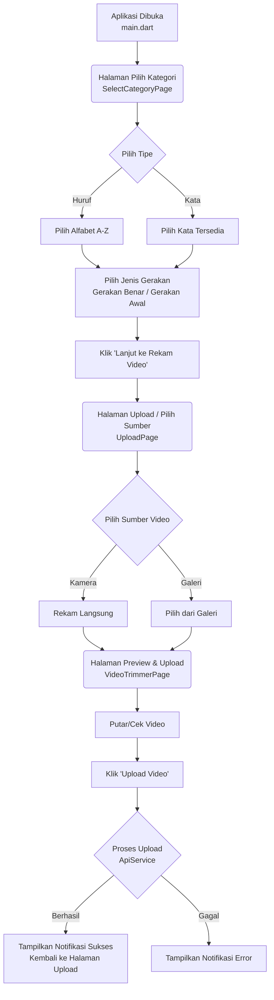

# Alur Aplikasi Aksa Capture (App Flow)

Dokumen ini menjelaskan alur lengkap (flow) dari aplikasi **Aksa Capture** saat ini, dari mulai aplikasi dibuka hingga proses upload video selesai.

## 1. Diagram Alur (Flowchart)

## 2. Penjelasan Tiap Halaman

### A. Halaman Utama / Pilih Kategori (`select_category.dart`)
Ini adalah halaman pertama yang dilihat oleh pengguna saat aplikasi dijalankan.
- **Tujuan:** Menentukan metadata dari video yang akan direkam/diunggah.
- **Langkah-langkah:**
  1. **Pilih Label:** Pengguna memilih tipe rekaman antara **Kata** (misal: kata-kata yang tersedia dari `AppWords`) atau **Huruf** (Alfabet A - Z).
  2. **Pilih Jenis Gerakan:** Setelah memilih label, akan muncul pilihan jenis gerakan:
     - **Gerakan Benar:** Jika isyarat sudah tepat dan akurat.
     - **Gerakan Awal:** Jika isyarat masih dalam tahap latihan/pembelajaran.
  3. **Lanjut ke Rekam:** Setelah semua opsi dipilih, sebuah tombol "Lanjut ke Rekam Video" akan muncul di bagian bawah. Menekan tombol ini akan membawa data (tipe, konten, dan status gerakan) ke halaman berikutnya.

### B. Halaman Sumber Video (`upload_page.dart`)
Halaman ini berfungsi sebagai jembatan untuk memilih atau merekam video.
- **Tujuan:** Mengambil file video dari perangkat pengguna.
- **Langkah-langkah:**
  1. Halaman ini menampilkan ringkasan pilihan dari halaman sebelumnya pada bagian header.
  2. Pengguna diberikan dua pilihan sumber video:
     - **Kamera:** Membuka kamera bawaan perangkat untuk merekam langsung (durasi maksimal 5 menit).
     - **Galeri:** Membuka penyimpanan perangkat untuk memilih video yang sudah ada.
  3. Setelah video dipilih, aplikasi akan memuat file video tersebut dan langsung mengarahkan pengguna ke halaman *Preview & Upload*.

### C. Halaman Preview & Upload (`video_trimmer_page.dart`)
Halaman ini digunakan untuk memastikan video yang dipilih sudah benar sebelum diunggah ke server.
- **Tujuan:** Memutar ulang (preview) video dan melakukan proses unggah.
- **Langkah-langkah:**
  1. **Preview:** Pengguna dapat memutar (`play`/`pause`) dan menggeser durasi video untuk memastikan kualitas dan isi video.
  2. **Proses Upload:** Saat pengguna menekan tombol "Upload Video", akan muncul *progress bar* dengan 4 tahapan:
     - *Siap* (Mempersiapkan video)
     - *URL* (Mendapatkan URL unggahan dari server)
     - *Upload* (Mengirim video ke Cloud/R2 via `ApiService`)
     - *Simpan* (Penyimpanan metadata berhasil)
  3. **Hasil:** 
     - Jika **Berhasil**: Halaman ini akan ditutup dan kembali ke `UploadPage` dengan membawa pesan sukses. Sebuah notifikasi sukses (*Toast*) akan muncul di layar.
     - Jika **Gagal**: Sebuah pesan *error* atau *snackbar* berwarna merah akan muncul untuk memberitahu pengguna tentang masalah yang terjadi (misalnya masalah jaringan).

## 3. Komponen Pendukung
- **Routing:** Navigasi antar halaman dilakukan menggunakan standar bawaan Flutter yaitu `Navigator.push()` dan `Navigator.pop()`.
- **State Management:** Menggunakan `StatefulWidget` dasar (`setState`) untuk interaksi UI pada setiap halamannya.
- **API & Layanan:** Proses upload dan koneksi ke backend dikelola oleh file `api_service.dart`.
